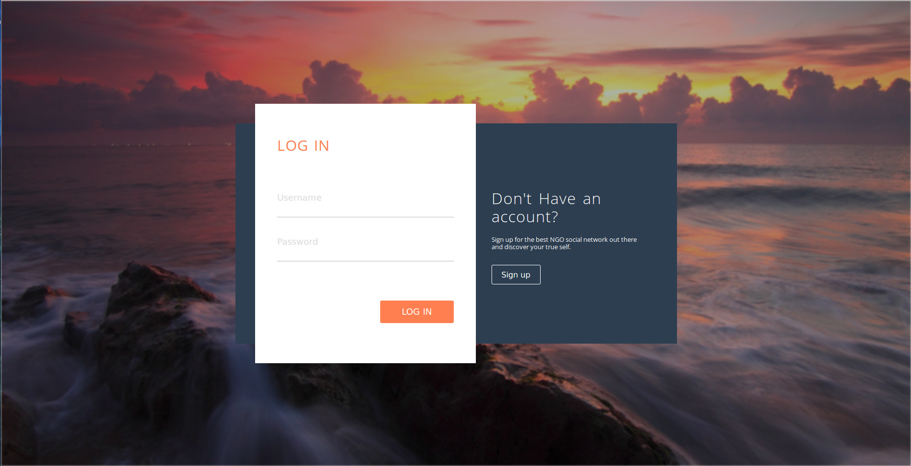

# Helping Hands

## Live Hosts

The project is hosted on https://helping-hands.au-syd.mybluemix.net/.

## Description

Helping Hands provides a platform to all the social organisations who want to reach out to the public to present their work and to people who want to volunteer for a social cause.
It is implemented in a way that provides a great user experience by enabling them to share their experience with other volunteers creating a community that believes in the same cause.

The above image is a still form the app.

## Technologies Used

* Node.Js - for server side programming.
* React.Js & Redux.Js - for client side programming.
* Socket.io - for real-time chat.
* Bluemix - for cloud deployment.
